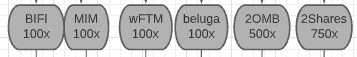

# 3OMB LAUNCH

## What happens first?

January 23rd, at 12:00 AM, the Genesis Pools will open. These are the tokens you can deposit and stake:

These tokens can be withdrawn at any time, by withdrawing them directly from the website or by interacting directly with the contract on [ftmscan.com](https://ftmscan.com). A guide regarding emergency withdrawals will be live soon, even though there is a 99.99% chance you will not need it.

The Genesis pool will be live for 72 hours and will stop distributing rewards on the 26th of January. You will be able to withdraw your funds even when the rewards stop being distributed.

Once the genesis pool is over, and users have their 3OMB, the farms will open.

## Farming Phase

### Phase(1) 3OMB-wFTM LP


contract: 0x14def7584a6c52f470ca4f4b9671056b22f4ffde


Once you have obtained your 3OMB (by buying through SpookySwap or from the Genesis Pool), you will be able to add 3OMB-wFTM liquidity through SpookySwap.

Head over to SpookySwap and select the amount of 3OMB you want to deposit. The corresponding amount in FTM will automatically be updated.

\
You will need to have a 50/50 ratio of 3OMB and FTM, so make sure you keep some FTM. You can buy 3OMB using [**SpookySwap**](https://spookyswap.finance/swap) and swapping your FTM for 3OMB.

Once you have obtained your LP tokens, head over to [**3FARMS**](https://3omb.finance/farms) \*\*\*\* and select the 3OMB-wFTM LP. Now approve the 3OMB-wFTM LP spending, then wait until this transaction is confirmed, and press on the "+", select the amount of LP tokens, and hit Deposit.

Congrats! You will now start receiving your rewards in 3Shares.

### Phase(2) 3SHARES-wFTM LP


contract: 0x6437adac543583c4b31bf0323a0870430f5cc2e7


Once you have obtained your 3SHARES (by buying through SpookySwap or from the 3OMB LP rewards). You will be able to add 3SHARES-wFTM liquidity for SpookySwap LP tokens.

Head over to SpookySwap and select the number of 3SHARES you want to deposit. The corresponding amount in FTM will automatically be updated.

\
You will need to have a 50/50 ratio of 3SHARES and FTM, so make sure you keep some FTM. You can buy 3SHARES using [**SpookySwap**](https://spookyswap.finance/swap) and swapping your FTM for 3SHARES.

Once you have obtained your LP tokens, head over to [**3FARMS**](https://3omb.finance/farms) and select the 3SHARES-wFTM LP. Now approve the 3SHARES-wFTM LP spending, wait until this transaction is confirmed, and press on the "+", select the amount of LP tokens, and hit Deposit.

Congrats! You will now start receiving your rewards in 3SHARES.

### Phase(3) Farming Phase

After X Hours (TBA), the additional farming pools will open. Here is the complete list of LP possibilities:

.png>)


All these LP farms will have rewards in 3SHARES. As you can see in the image, some pools have reward multipliers.

