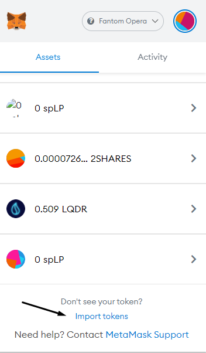

# 💳 Buying Fantom

## Bridging your tokens

If you already have tokens on other blockchains, you can bridge them to get their equivalent value on the Fantom Chain. Here are your options:&#x20;

### Synapse Protocol

Here is our favorite option: [Synapse Protocol](https://synapseprotocol.com/?inputCurrency=BUSD\&outputCurrency=USDC\&outputChain=250), you can swap your stable coins from chain to chain for very reasonable fees. Head over to a DEX on your base chain (BSC in our example) so [PancakeSwap](https://pancakeswap.finance/swap), and swap your BNB to BUSD. You can now head over to [Synapse Protocol](https://synapseprotocol.com/?inputCurrency=BUSD\&outputCurrency=USDC\&outputChain=250) (be sure to be on the right network on MetaMask or the output will not work) so Binance Smart Chain in our case. You can now bridge your tokens and will receive USDC on the Fantom Chain.\
If you do not see your USDC on Fantom, don't freak out yet! You need to import the USDC token into MetaMask

You can head over to [ftmscan](https://ftmscan.com) and look up your token (in our case USDC), then copy and paste the contract address in the "Import tokens" section on MetaMask (wait a few seconds until it loads up).&#x20;

### SideShift.ai

[Sideshift.ai](https://sideshift.ai) is a great option for fast swapping with very decent fees.\
Chose FTM as output and the token you want as input. (MIM in our example on Avalanche).\
Click on "Get Address from MetaMask"

 (1).png>)

then press "Shift"&#x20;

Copy the address

Now head over to MetaMask (on the Avalanche network in our example), click "Send" (sorry i'm baguette so Envoyer in my case)  \
Paste the address you copied from Synapse, enter the amount you want to bridge, (check the Min/Max amount before sending), and don't forget to change the token you want to send to the one you chose (MIM in our case).\
You can now send, after a few seconds/minutes, Sideshift will let you know it received your tokens and will tell you once it sends you your tokens. \
You can now change network on MetaMask and see your sweet sweet FTM in your wallet.
