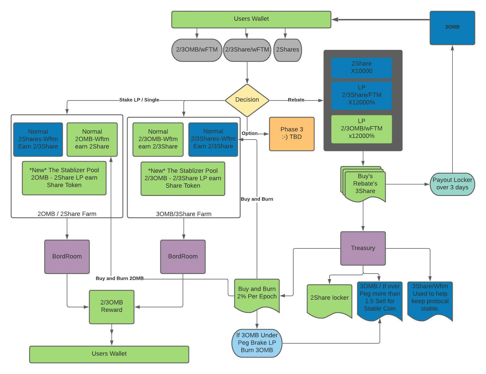

# 🚀 What is a T|2|3OMB Protocol?


Please note that none of this is financial advice. You should do your due diligence to become an informed investor by doing your own research, coming to your own conclusions, and taking note of the risks and responsibilities associated with participating in 2|3OMB, or any other DeFi smart contract.


Seigniorage is the difference between the face value of a currency, such as a $10 coin/token - and the cost to produce it. When the cost of minting a token within any given ecosystem, is lower than the actual market exchange value (positive seigniorage) then a yield is accrued by the party (contract) that mints the tokens.

When applied to crypto and blockchain, you can do some interesting things. It is the main principle and mechanic at the core of our protocols. Here is the flow of the original protocol that T|2OMB used.


The team is available in the Discord to answer questions, so please reach out if they're not answered here! We are on a mission to bring ACCOUNTABILITY into the TRUST-LESS world of Decentralized Finance - aka DeFi - setting a new standard for what is acceptable, responsible, and transparent enough, such that the team, community, and investors have all the information they need, all the education the need, and all the confidence they need to do great things in this space.


## What does 3OMB bring to the table?

There has been some innovation and improvement to the protocol, see below;

## Why is this important?

Why have a token that’s pegged to the price of $FTM when you could just use $FTM itself instead?

Good question!\
\
But before we dive into what $3OMB could mean for you as an investor, let’s break down the potential impact of $3OMB and it's role in helping the long-term success of the Fantom ecosystem as a whole.

For Fantom to continue running as the fast, secure, and cost-effective blockchain we all know and love, its validator nodes will continue to rely on its $FTM token remaining staked and locked up, in increasing amounts over time as the number of validators on the network grows.\
\
FTM is distributed as a reward to all validator nodes, which will continue to increase in number to sustain the network's growth. However, the $FTM token itself has a fixed total with a maximum supply of 3.175 billion tokens. At the time of writing this, the staking requirement for a validator node requires 1,000,000 $FTM (soon to be voted down to 100,000 FTM) to be locked into that node for its lifespan. Additionally, people can 'Delegate' any amount of FTM to be locked onto the node for 14-365 days to earn passive income.

As of 2.08.2022;

* 1,348,136,212 FTM (51% of Circulating Supply) Locked in Validator Nodes
* 2,657,587,186 FTM (Circulating Supply)
* 3,175,000,000 FTM (Maximum Supply)

So if $FTM is intended to be viable as a cheap, fast, decentralized alternative to Ethereum and others, what will happen when there just isn’t enough Opera-native $FTM to go around?

If $3OMB succeeds in holding the peg, this will create a mirrored, liquid asset that can be moved around and traded without restrictions, all while benefiting from the price appreciation of the native $FTM token. Reaching the peg and holding the peg is crucial, and this will ultimately be what drives the value of $3OMB for investors. In the short term, this would mean attractive APRs for liquidity providers on what would _essentially_ be a stable pair.

So, once a liquid market is established, what happens next? What are some other reasons you’d want to hold $3OMB?

$3OMB aims to become a major player in driving liquidity for the current ecosystem, and to become the new standard for DAO and algorithmic stable-coins in the future. The next generation of Fantom DeFi projects will be incentivized and leveraged by those who participate in projects like T|2|3OMB Finance.

### So what?...What does this really mean?

You may have read that by pegging to $FTM, $3OMB hopes to become a highly liquid, mirrored asset. What does this actually mean though?

As an example, say the dollar is the world's main medium of exchange. Everything is measured in terms of dollars, whether that's your weekly salary, or whether it's the price of bread or a computer. And you need dollars to buy literal gas to get to the bakery, or to the computer store.

But imagine if nobody wanted to use their dollars, and preferred to keep them under their mattresses instead. Since the value of everything gravitates in relation to the dollar, there would need to be something out there that is 1:1 "interchangeable" with the dollar, so that even if all the dollars in the world were tucked under mattresses, people could continue to transact freely.

Knowing that whatever they received would be able to be traded in for a dollar at whatever point in time they so desired. **That's what $3OMB hopes to become for $FTM.**
