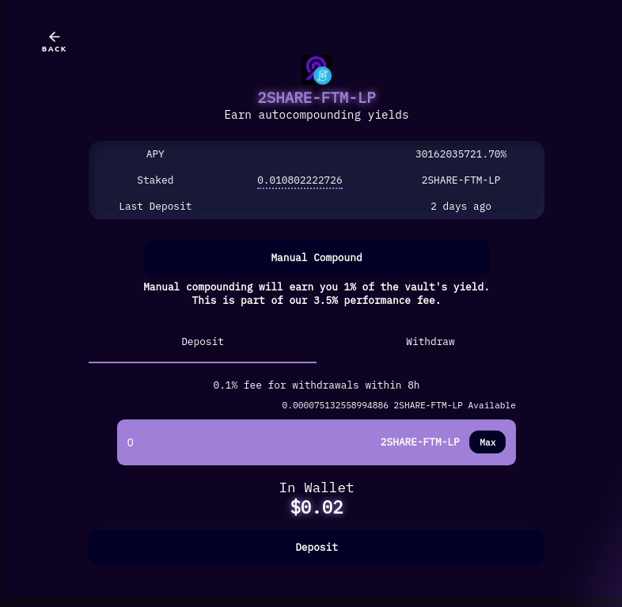
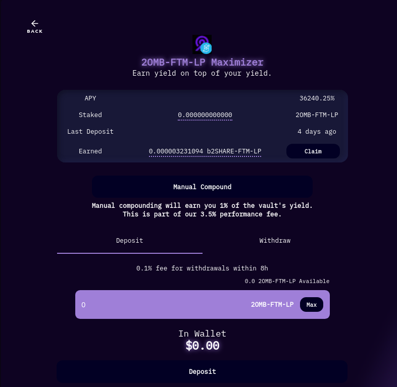
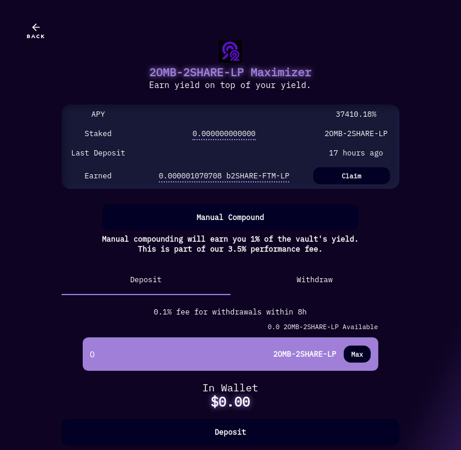
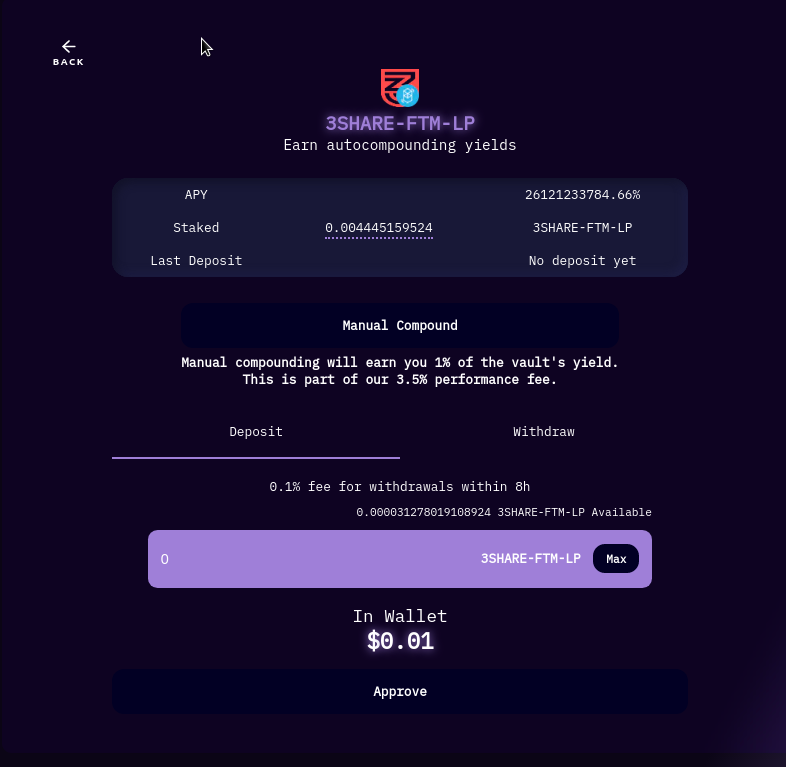

# Beluga Finance

Beluga lets you deposit your LP tokens, and manually compound with a click of a button. It's highly efficient and is healthier for the token than YieldWolf. However, they have an interesting strategy.&#x20;


**Beluga only rewards 2/3SHARES-wFTM LP no matter which pool you stake in**


### 2SHARES-wFTM LP Vault

* **Yield from Maximizer pools gets automatically staked here when you click the "claim" button for the Maximizer reward**
* **Earn 2SHARES-wFTM LP**
* **Auto Compounder**

### 2OMB-wFTM LP Maximizer

* **Earn b2SHARES-wFTM LP**
* **Maximizers yield into the reward LP, earning you higher yields from the yield that the LP provides.**

### **2OMB-2SHARES LP Maximizer**

* **Earn b2SHARES-wFTM LP**
* **Maximizers yield into the reward LP, earning you higher yields from the yield that the LP provides.**

### **3SHARES-wFTM LP Vault**

* **Yield from Maximizer pools gets automatically staked here when you click the "claim" button for the Maximizer reward**
* **Earn 3SHARES-wFTM LP**
* **Auto Compounder**

### **3OMB-FTM-LP Maximizer**

* **Earn b3SHARES-wFTM LP**
* **Maximizers yield into the reward LP, earning you higher yields from the yield that the LP provides.**

